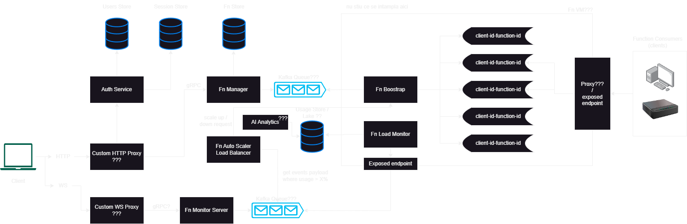
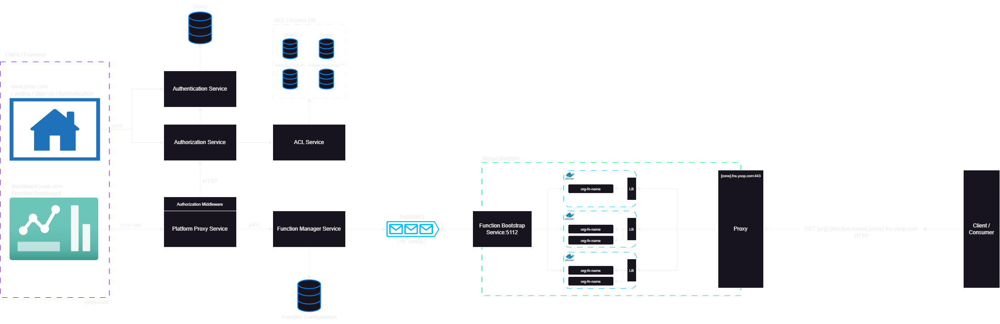

# Architecture

Diagrams should be available in `/static/img` in a `.drawio` format. You can use [draw.io](https://www.drawio.com) to edit the diagrams.
You can also find the `.drawio` diagrams in the [yoop-diagrams](https://github.com/Yoop-Platform/yoop-diagrams) repository.

The first image represents the initial draft for the architecture. The image below represents an updated, cleaned-up version of the architecture, but it's missing the analytics, AI and pricing components.

