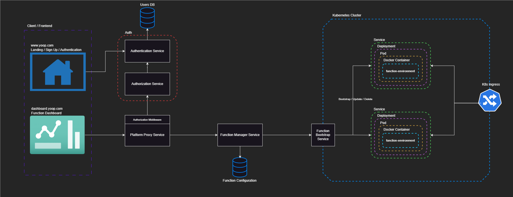

# Architecture

Diagrams should be available in `/static/img` in a `.drawio` format. You can use [draw.io](https://www.drawio.com) to edit the diagrams.
You can also find the `.drawio` diagrams in the [yoop-diagrams](https://github.com/Yoop-Platform/yoop-diagrams) repository.

The first image represents the initial draft for the architecture. The image below represents an second, cleaned-up version of the architecture, but it's missing the analytics, AI and pricing components.

The image below represents the latest and current architecture, missing AI and pricing components. This version strips away ACL components and simplifies the interaction between the function manager and the function bootstrapper, removing the RabbitMQ instance in between. This came due to the fact that the RabbitMQ instance was not necessary and represented a point of failure and complexity that was not needed. Allowing RabbitMQ to be used would've meant additional complexity due to the services required to additionally orchestrate the communication to enable responses being sent back to the initial client.

Kubernetes is also taking place of the VM present in the initial diagrams, as it allows for more straight forward scalability and management, allowing us to use K8s' built-in features to manage the services and their scaling, instead of writing our own scaling logic in a VM. Of course, this comes with the cost of having to manage the K8s cluster and it's complexity, but it's a trade-off that allows us to focus on the core functionality of writing and deploying functions, instead of focusing on different types of algorithms required to manage the scaling, orchestration, routing and discovery of the functions.

